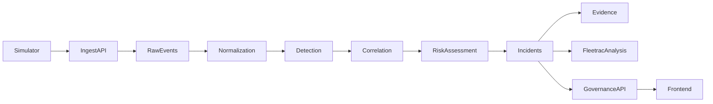
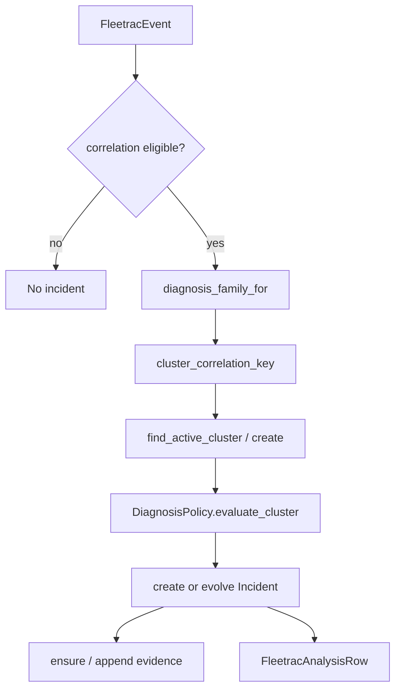

# Fleetrac architecture

Documented from repository inspection. Do not invent modules that are not present.

Related: [`implementation-rules.md`](implementation-rules.md), [`../product/current-stage.md`](../product/current-stage.md).

## Conceptual flow

Actual primary code path for v2 bundles:

`simulator/*` → `http_ingest_client.post_ingest_event` → `POST /api/v1/ingest/events` → `services/ingest_pipeline.py` → `pipeline/adapters/*` + `pipeline/normalizer.py` → `detection/engine.evaluate_event` → `correlation/engine.process_correlation_event` → DB incidents/evidence/analysis → `governance/read_models.py` + routes → `apps/web` via `governance-api.ts`.

## Repo layout

| Path | Role |
|------|------|
| `apps/web/` | Next.js 15 App Router UI |
| `apps/api/` | FastAPI backend (`main.py` → `app`) |
| `apps/api/data/fleetrac_sim.db` | Local SQLite runtime DB (when present) |
| `packages/shared/` | Shared entity contracts (`contracts/entities.ts`, `entities.json`) |
| `AGENTS.md` | Agent operating instructions |
| `docs/` | Product / engineering / AI handoff docs |
| `.cursor/rules/` | Cursor always-applied rules |

Root `package.json` only lists a few shared frontend deps; web app owns its own `apps/web/package.json` + lockfile. API deps: `apps/api/requirements.txt` (no `pyproject.toml` found).

## Backend app structure (`apps/api/app/`)

| Package | Responsibility |
|---------|----------------|
| `api/routes/` | HTTP routers (health, ingest, governance, simulator, systems, incidents, actions, bob, …) |
| `core/` | Settings / config |
| `db/` | SQLAlchemy models, session, seed |
| `fleet/` | Canonical system + rule registry, metadata |
| `simulator/` | Generators, scenarios, trace builder, HTTP ingest client, runner |
| `pipeline/` | Adapters (OTEL, cloud), normalizer, semconv |
| `detection/` | Rule engine; legacy `correlator.py` helper |
| `correlation/` | Cluster engine, families, policies, scoring, analysis builder |
| `governance/` | Incidents, evidence, analysis, notifications, actions, verification, read models |
| `services/` | Ingest pipeline, event stream, assorted domain services |
| `schemas/` | Pydantic DTOs (`ingestion`, `fleetrac_event`, `governance`, …) |
| `rules/` | Additional rules package (alongside detection) |
| `sample_data/` | Legacy/demo sample payloads |
| `slice_a/` | Thin re-exports of treasury pitch constants (legacy) |

Entry: `apps/api/main.py` mounts routers under `settings.api_prefix` (typically `/api/v1`). Dev lifespan seeds DB and may start continuous simulator.

## Frontend app structure (`apps/web/`)

| Area | Path |
|------|------|
| Routes | `app/` — `page.tsx` (dashboard), `live-signals/`, `incidents/`, `systems/`, `actions/`, `outcomes/`, `settings/`, plus legacy `activity/`, `controls/`, `usage/`, `rules/` |
| Nav | `lib/nav.ts` — seven primary items |
| Routes helpers | `lib/routes.ts` |
| Governance client | `lib/governance-api.ts`, `governance-merge.ts`, `governance-types.ts` |
| Hooks | `hooks/use-governance-data.ts`, `use-event-stream.ts` |
| Workspaces | `components/dashboard/`, `live-signals/`, `incidents/`, `actions/`, `evidence-library/`, `systems*`, `operations/`, `fleetrac/` |
| Shell | `components/layout/governance-page-shell.tsx`, `sidebar.tsx`, `app-chrome.tsx` |

Redirects in `next.config.ts`: `/bob` → `/`, `/activity` → `/`, `/controls` → `/systems`, `/usage` → `/`, `/rules` → `/settings`.

## Simulator structure (`apps/api/app/simulator/`)

| Piece | Role |
|-------|------|
| `generators/` | Archetype generators (`decision`, `retrieval`, `document`, `security_operations`, `healthy_traffic`) |
| `scenarios/` | Pitch/scenario modules + `mutations.py` (impact modes) |
| `trace_builder.py` | Assembles v2 bundles |
| `span_templates.py` | Per-system span naming |
| `healthy_variation.py` | Wait spans and healthy variation |
| `http_ingest_client.py` | **Required** HTTP (or test ASGI) POST to ingest |
| `runner.py` / `engine.py` | Continuous / batch execution |
| `config/pitch_aliases.py` | Treasury constants + pitch alias map |
| `fixtures/raw/` | Sample cloud raw JSON |

## Ingestion flow

1. Validate envelope (`services/ingest_validator.py`)
2. Reject unknown `system_id`
3. Idempotency via `raw_events.idempotency_key`
4. Persist one `raw_events` row per POST
5. For v2: each span → `adapt_v2_span` → `normalize_adapted` → `normalized_events`
6. Detection + correlation per eligible span
7. Retention prune: 10k raw / 5k normalized (`ingest_pipeline.py`)
8. Broadcast to SSE consumers

## Normalization flow

- Adapters: `pipeline/adapters/otel_agent.py` (primary), router + cloud adapters
- `normalize_adapted` builds `FleetracEvent`
- Healthy: null signal type / severity / confidence
- Latency: `span_duration_ms` (wall clock) vs `operation_latency_ms` (provider ops only; root `agent.request` excluded)
- Event-level `correlation_key` in normalizer uses `system_id:signal_type:environment:rule_id` (distinct from **cluster** key below)

## Detection flow

- `detection/engine.evaluate_event(event, rules)` against enabled `detection_rules`
- Rule specs: `fleet/registry.py` (`RULE_SPECS`)
- Latency field resolution prefers `evaluation_signals.operation_latency_ms`
- Returns `DetectionMatch` or none

## Correlation / risk flow

- Eligibility: `correlation/engine.is_correlation_eligible` (excludes healthy-without-signal, `operation_type == wait`, `*.wait` span names)
- Family: `diagnosis_family_for(system_id, signal_type)`
- Cluster key: `tenant_id:environment:system_id:diagnosis_family`
- Window: **15 minutes** (`CORRELATION_WINDOW_MINUTES` in `correlation/families.py`)
- Policies score Medium / High / Critical; update incident; append severity history; refresh Fleetrac Analysis

## Incident / evidence flow

- Incident IDs: canonical `inc_{system}_{signal}_001` + `alias_id` for pitch deep links
- `responder_team` from risk category map; `accountable_owner_team` from system registry
- Evidence record unique per incident; items reference contributing events/traces
- Actions: `governed_actions` + `verification_outcomes`

## Database models / tables

From `apps/api/app/db/models.py`:

| Table | Model |
|-------|-------|
| `systems` | `System` |
| `detection_rules` | `DetectionRule` |
| `raw_events` | `RawEvent` |
| `normalized_events` | `NormalizedEvent` |
| `incidents` | `Incident` |
| `evidence_records` | `EvidenceRecord` |
| `evidence_items` | `EvidenceItem` |
| `fleetrac_analysis` | `FleetracAnalysisRow` |
| `notifications` | `Notification` |
| `assignments` | `Assignment` |
| `signal_clusters` | `SignalCluster` |
| `risk_assessments` | `RiskAssessment` |
| `severity_history` | `SeverityHistory` |
| `simulator_state` | `SimulatorState` |
| `governed_actions` | `GovernedActionRow` |
| `verification_outcomes` | `VerificationOutcomeRow` |

## API routes (high level)

Prefix: `/api/v1` (via settings).

| Area | Examples |
|------|----------|
| Health | `GET /health` (via health router) |
| Ingest | `POST /ingest/events` |
| Governance | `GET /governance/live-signals`, `ingest-log`, `systems`, `owner-queue`, `evidence-library`, `dashboard-summary`, `notifications`, `actions`; `POST .../lifecycle`, `.../actions`, `actions/{id}/approve|reject|verify`; assessment + severity-history + clusters |
| Simulator | `status`, `reset`, `start`, `stop`, `runs`, `scenarios`, `pitch/{id}` |
| SSE | `GET /events/stream` |
| Legacy / other | `systems`, `incidents`, `actions`, `rules`, `telemetry`, `operations`, `bob`, `audit_logs` |

Exact path list: inspect `apps/api/app/api/routes/*.py` and OpenAPI at `/docs` when server is running.

## Frontend pages / components (primary)

| Page | Entry | Primary workspace |
|------|-------|-------------------|
| Dashboard | `app/page.tsx` | `components/dashboard/*` |
| Live Signals | `app/live-signals/page.tsx` | `components/live-signals/*` |
| Incident Queue | `app/incidents/page.tsx` | `components/incidents/incident-queue-workspace.tsx` |
| System Registry | `app/systems/page.tsx` | `components/systems-fleet-view.tsx` |
| Action Center | `app/actions/page.tsx` | `components/actions/action-center-workspace.tsx` |
| Evidence Library | `app/outcomes/page.tsx` | `components/evidence-library/*` |
| Settings | `app/settings/page.tsx` | `components/operations/settings-view.tsx` |

## Test structure (`apps/api/tests/`)

| Area | Examples |
|------|----------|
| Unit / slice | `test_ingest.py`, `test_normalizer.py`, `test_otel_agent.py`, `test_latency_semantics.py`, `test_correlation_risk.py`, `test_correlator.py`, `test_evidence.py`, … |
| Adapters | `tests/adapters/test_cloud_adapters.py` |
| Governance | `tests/governance/test_actions_verify.py`, `test_bob_deprecation.py` |
| E2E | `tests/e2e/test_*` — treasury, phish, CS latency, full pitch, verticals |
| Config | `pytest.ini` — `testpaths = tests`, `pythonpath = .` |

Frontend: no dedicated test runner script in `package.json`; quality gate is `npm run build` + `npm run lint`.

## Diagnosis families (code IDs)

| Constant | ID string | Label |
|----------|-----------|-------|
| `OUTPUT_RELIABILITY` | `output_reliability_control_degradation` | Output reliability control degradation |
| `TOOL_GOVERNANCE` | `prompt_injection_tool_governance_violation` | Prompt-injection-driven tool governance violation |
| `PLATFORM_RELIABILITY` | `provider_degradation_routing_reliability` | Provider degradation affecting routing reliability |

## Known mismatches (do not paper over)

1. **Correlation window:** 15m in `correlation/families.py` vs 30m in `simulator/config/pitch_aliases.py` (re-exported by `slice_a`, used by legacy `detection/correlator.py`).
2. **Two correlation key formats:** event-level normalizer key vs cluster diagnosis-family key.
3. **Activity UI:** page exists; redirect disables primary access.
4. **Bob:** routes/types/sample data remain in places; product language is Fleetrac Analysis.
